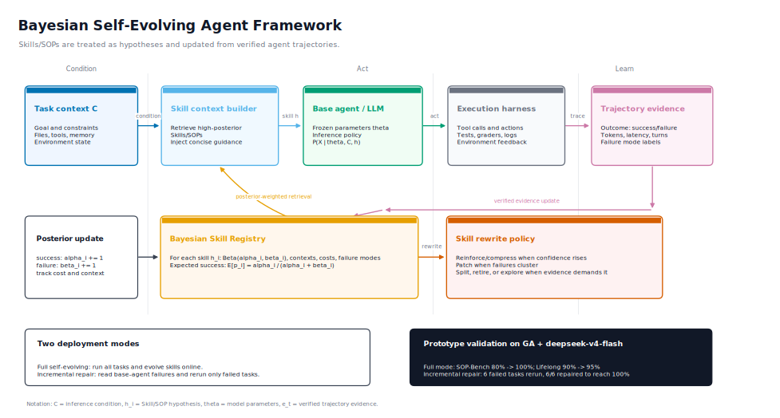

# Bayesian-Agent

<div align="center">
  
</div>

<p align="center">
  <a href="README.md">English</a> | <a href="README_ZH.md">中文</a> |
  <a href="https://github.com/DataArcTech/Bayesian-Agent">GitHub</a>
</p>

Bayesian-Agent 是一个独立的 Bayesian Self-Evolving Agent 框架，用于把 Agent 的失败轨迹转化为可复用、可验证、带 posterior 权重的 Skills 和 SOPs。

> v0.4 是第一个独立开源版本。它包含 Bayesian Skill Evolution 核心包、Schema、CLI 工具、实验 artifacts，以及干净的 GenericAgent 集成边界。GenericAgent 本身不会被复制、vendoring 或 fork 到本仓库中。

## 项目简介

LLM Agent 工程正在经历三层演化：

1. **Prompt Engineering**：把任务指令写得更清楚。
2. **Context Engineering**：决定推理时模型能看到什么证据。
3. **Harness Engineering**：把模型放进一个可执行、可观测、可恢复的系统里。

Prompt 可以改善单轮回答。Context 可以改善单次决策。Harness Engineering 解决的是更现实的问题：Agent 要跨工具、文件、测试、日志、记忆和失败恢复连续工作。

在这个语境下，**Skill** 和 **SOP** 不再只是长 prompt，而是 Agent 的核心工程资产。一条好的 Skill 是压缩后的操作知识：

- 先检查什么
- 用哪些工具
- 如何验证进度
- 哪些失败模式要规避
- 什么时候停止、重试或重写流程

Bayesian-Agent 想回答的问题是：既然 Skill 本质上是“如何完成任务”的假设，为什么它的进化要靠经验堆叠，而不是靠证据更新？

## 核心思想

从 MECE 的角度看，大语言模型系统优化只有两条路：

1. 改变模型参数分布，例如预训练、微调、强化学习。
2. 改变推理条件，例如 prompt、context、RAG、工具、记忆和 harness。

Bayesian-Agent 聚焦第二条路。

如果基础模型采样自：

```text
P(X | theta)
```

那么 Agent 系统采样自：

```text
P(X | theta, C)
```

其中 `C` 是推理环境。Skills、SOPs、工具、记忆、检索证据、执行轨迹和 verifier 反馈都属于 `C`。

Bayesian-Agent 把每条 Skill 或 SOP 看作一个关于成功率的假设：

```text
P(success | theta, C, skill)
```

每次得到经过验证的执行轨迹后，框架都会更新该 Skill 的 posterior belief。下一次运行时，Agent 拿到的是 posterior 加权后的 Skill context，而不是未经筛选的长记忆。

## 核心特性

- **证据加权的 Skill 进化**：从 verified success/failure trajectory 更新 Skill belief。
- **Bayesian Skill Registry**：维护 Beta posterior、失败模式、token 成本、延迟、轮次和 context 分布。
- **面向失败模式的修复**：识别反复出现的错误，生成聚焦的 repair plan。
- **Token-aware context 构建**：只注入真正有 posterior 证据价值的 Skill。
- **全量与增量两种模式**：既可以从零进化，也可以作为既有 Agent 的修复层。
- **框架无关的边界**：通过 adapters 集成 GenericAgent 或其他 harness，而不是复制它们的代码。
- **标准库优先**：v0.4 核心运行时不依赖 Python 标准库之外的包。

## 自我进化机制

```text
[Agent Trajectory]
      |
      v
[Verifier / Benchmark Grader]
      |
      v
[TrajectoryEvidence: success, failure mode, tokens, turns, latency]
      |
      v
[Bayesian Skill Registry: posterior + cost + contexts]
      |
      v
[Rewrite Policy: compress, patch, split, retire, explore]
      |
      v
[Posterior-Weighted Skill Context]
      |
      v
[Next Agent Run]
```

对每条 Skill 或 benchmark SOP，Bayesian-Agent 会维护：

- 成功率的 Beta posterior
- 经过验证的成功和失败证据
- 失败模式计数
- input、output、total token 统计
- 延迟和轮次统计
- context 分布
- rewrite policy 建议

默认 rewrite policy 保持小而清晰：

| Posterior 信号 | Policy 动作 |
|---|---|
| 多次验证成功 | compress 或 reinforce |
| 失败模式聚集 | patch |
| 不同 context 下表现分化 | split 或 specialize |
| 失败占主导 | retire 或 rewrite |
| 证据稀疏 | explore |

## 安装

```bash
git clone https://github.com/DataArcTech/Bayesian-Agent.git
cd Bayesian-Agent
python -m pip install -e .
```

当前版本要求 Python 3.9+，运行时不依赖 Python 标准库之外的包。

## 快速开始

从已有 Agent 结果中更新 Bayesian Skill registry：

```bash
bayesian-agent evolve \
  --results artifacts/ga_deepseek_baseline/sop_results.json \
  --registry temp/bayesian_skill_beliefs.json \
  --context-out temp/skill_context.md
```

找到需要增量修复的失败任务：

```bash
bayesian-agent repair-plan \
  --baseline artifacts/ga_deepseek_baseline/sop_results.json \
  --out temp/failed_tasks.json
```

汇总一次运行：

```bash
bayesian-agent summarize \
  --results artifacts/bayesian_incremental/results.json \
  --out temp/summary.json
```

## Python API

```python
from bayesian_agent import BayesianSkillRegistry, SkillContextBuilder, TrajectoryEvidence

registry = BayesianSkillRegistry("temp/beliefs.json")
registry.record(
    TrajectoryEvidence(
        task_id="sop_12",
        skill_id="benchmark/sop_bench",
        context="sop_bench",
        outcome="failure",
        failure_mode="xml_wrapped_answer",
        input_tokens=70123,
        output_tokens=4242,
        total_tokens=74365,
    )
)

skill_context = SkillContextBuilder(registry).render(task_context="sop_bench")
print(skill_context)
```

## 两种运行模式

### 全量 Self-Evolving Mode

Bayesian-Agent 从零开始运行 benchmark tasks，收集 verified evidence，并在运行过程中持续进化 Skills。

这个模式验证的是：在没有先验 benchmark traces 的情况下，Bayesian Skill Evolution 是否能提升 Agent。

### 增量 Repair Mode

Bayesian-Agent 也可以挂载到一个已有 Agent 后面。基础 Agent 先跑一遍，Bayesian-Agent 读取其成功和失败轨迹，更新 Skill posterior，然后只重跑失败任务。

```text
Base Agent -> Failure Traces -> Bayesian Skill Evolution -> Rerun Failures -> Higher Accuracy
```

这是更推荐的生产路径，因为它不需要重新训练模型，也不需要替换原有 harness。

## 实验结果

v0.4 原型基于 GenericAgent 与 `deepseek-v4-flash`，在 SOP-Bench 和 Lifelong AgentBench 上完成验证。

### Baseline: GenericAgent + deepseek-v4-flash

| Benchmark | Agent | Model | Accuracy | Input Tokens | Output Tokens | Total Tokens | Efficiency |
|---|---|---|---:|---:|---:|---:|---:|
| SOP-Bench | GA | deepseek-v4-flash | 80% | 1.34M | 57k | 1.39M | 11.47 |
| Lifelong AgentBench | GA | deepseek-v4-flash | 90% | 649k | 42k | 690k | 26.07 |

### 全量 Self-Evolving Run

| Benchmark | Agent | Model | Accuracy | Input Tokens | Output Tokens | Total Tokens | Efficiency |
|---|---|---|---:|---:|---:|---:|---:|
| SOP-Bench | GA+Bayesian | deepseek-v4-flash | 100% | 1.07M | 52k | 1.12M | 17.86 |
| Lifelong AgentBench | GA+Bayesian | deepseek-v4-flash | 95% | 666k | 44k | 710k | 26.77 |

全量模式下，Bayesian-Agent 将 SOP-Bench 从 80% 提升到 100%，同时 token 消耗从 1.39M 降到 1.12M。Lifelong AgentBench 从 90% 提升到 95%，token 成本基本相当。

### 增量 Repair Run

增量模式下，Bayesian-Agent 只重跑 GenericAgent 的失败任务：

- SOP-Bench：4 个失败任务，全部修复
- Lifelong AgentBench：2 个失败任务，全部修复

| Benchmark | Agent | Model | Final Accuracy | Incremental Input | Incremental Output | Incremental Total | Incremental Efficiency |
|---|---|---|---:|---:|---:|---:|---:|
| SOP-Bench | GA+BayesianIncremental | deepseek-v4-flash | 100% | 216k | 10k | 226k | 17.73 |
| Lifelong AgentBench | GA+BayesianIncremental | deepseek-v4-flash | 100% | 71k | 7k | 78k | 25.57 |

这说明 Bayesian-Agent 可以作为即插即用的 repair layer：接在一个未达到 100% 准确率的 Agent 后面，用较小的增量推理成本把失败任务补齐。

实验 artifacts 位于 [`artifacts/`](artifacts/)，方法说明位于 [`docs/method.md`](docs/method.md)。

## 与 GenericAgent 的关系

第一个原型是在 GenericAgent 内部验证的，但 Bayesian-Agent 不是 GenericAgent fork。

开源结构是：

- `bayesian_agent/core/`：框架无关的 Bayesian Skill Evolution 逻辑
- `bayesian_agent/adapters/base.py`：外部 Agent 的最小 adapter contract
- `bayesian_agent/adapters/generic_agent.py`：可选 GenericAgent 集成边界
- `schemas/`：可移植的 trajectory 与 Skill belief schema
- `artifacts/`：可复现实验结果文件

GenericAgent 仍然只是可选后端。其他 Agent harness 只要能产出统一 trajectory schema，也可以接入 Bayesian-Agent。

MinimalAgent adapter 在 v0.4 中按计划暂不提供。

## 仓库结构

```text
bayesian_agent/
  core/                 # Evidence, beliefs, registry, policy, context, repair
  adapters/             # Adapter contract and optional GenericAgent boundary
schemas/                # JSON schemas for trajectories and Skill beliefs
artifacts/              # Baseline, full-mode, and incremental-mode result artifacts
docs/                   # Method and experiment notes
examples/               # Integration notes
tests/                  # Standard-library unittest suite
```

## Roadmap

- [x] 将 GenericAgent 原型重构为独立 package core。
- [x] 定义通用 agent run trace schema。
- [x] 实现 Bayesian Skill registry。
- [x] 实现 full self-evolving primitives。
- [x] 实现 incremental repair utilities。
- [x] 增加 GenericAgent optional adapter boundary，不 vendoring GenericAgent。
- [x] 发布实验结果 artifacts。
- [x] 增加英文和中文 README。
- [ ] 增加可在外部 checkout 中执行的 benchmark runners。
- [ ] 增加更丰富的 rewrite policies 和 adapter examples。
- [ ] GenericAgent 边界稳定后再扩展更多 agent harness adapters。

## 当前状态

Bayesian-Agent v0.4 是早期独立版本。当前 package 可用于 trace ingestion、Bayesian Skill belief update、context rendering、repair planning 和 result summarization。完整 benchmark execution 仍依赖 GenericAgent 等外部 Agent harness。

## License

MIT License. 详见 [`LICENSE`](LICENSE)。
