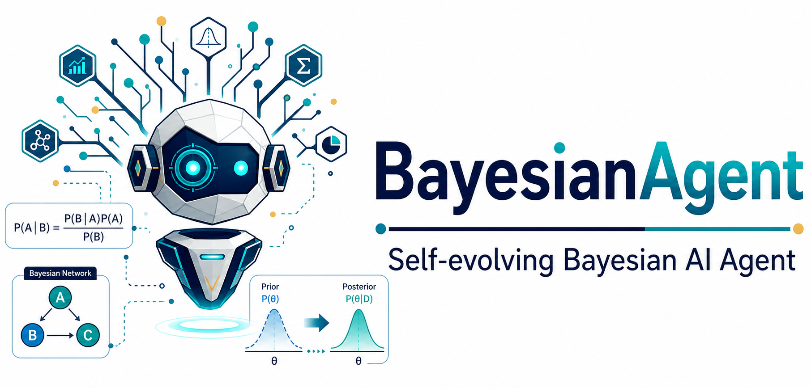
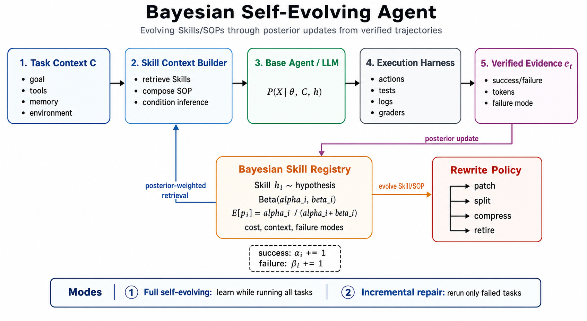

# Bayesian-Agent: A Bayesian Self-Evolving Agent Framework with Cross-Harness Adaptation

<div align="center">
  
</div>

<p align="center">
  🌐 <a href="README.md">English</a> | 🇨🇳 <a href="README_ZH.md">中文</a> |
  📚 <a href="https://dataarctech.github.io/Bayesian-Agent/">Docs</a> |
  🐙 <a href="https://github.com/DataArcTech/Bayesian-Agent">GitHub</a> |
  📄 <a href="http://arxiv.org/abs/2606.08348">arXiv:2606.08348</a>
</p>

Bayesian-Agent 是一个面向跨 Agent framework / execution harness 的 Bayesian self-evolving layer，用于把 verified agent trajectories 转化为可复用、可验证、带 posterior 权重的 Skills 和 SOPs。

它支持三种使用方式：

- **从零自进化**：没有历史 traces 也能从完整 benchmark 或生产任务中在线沉淀 Skills。
- **增量修复**：接到已有 Agent 后面，读取失败轨迹，只重跑需要修复的任务。
- **自家 harness + 跨 harness 适配**：默认使用 Bayesian-Agent 自己的 native harness，也可以通过统一 trajectory schema 和 adapter boundary 接入 GenericAgent、mini-swe-agent、Claude Code 以及其他 agent runtimes。

> v0.5 在 Bayesian Skill Evolution 核心之上新增了自家 native harness。GenericAgent、mini-swe-agent、Claude Code 是兼容 backend；它们不会被复制、vendoring 或 fork 到本仓库中。

## 📅 News

- **2026-06-09:** Bayesian-Agent 论文已发布到 arXiv：[arXiv:2606.08348](http://arxiv.org/abs/2606.08348)。
- **2026-06-05:** 新增 SOP-Bench、Lifelong AgentBench、RealFin-Bench 的 native-harness 全样本结果，覆盖 `deepseek-v4-flash` 和 `deepseek-v4-pro`；详见 [实验结果](#-实验结果)。
- **2026-06-05:** 新增 Bayesian-Agent 自家 native harness：由 BA 自己运行 LLM loop、workspace tools、可选三层记忆和 trajectory capture；GenericAgent、mini-swe-agent、Claude Code 保留为可选兼容 backend。详见 [Native Harness 设计说明](docs/native-harness.md)。
- **2026-05-31:** 将 Bayesian Evidence Model 作为默认 Skill belief backend：当前实现使用 categorical likelihood，同时保留 Beta-Bernoulli 作为消融和兼容 backend。
- **2026-05-09:** 发布 Bayesian-Agent 独立 package，包含跨 harness Bayesian Skill Evolution 核心 primitives、schemas、CLI utilities 和实验 artifacts。
- **2026-05-09:** 增加可选 GenericAgent adapter boundary，不复制、不 vendoring GenericAgent。
- **2026-05-09:** 发布中英文项目文档和 Bayesian-Agent 方法框架图。

## 🌟 项目简介

Prompt Engineering 改善任务指令。Context Engineering 控制推理时模型能看到什么证据。Harness Engineering 把模型放进可执行、可观测、可恢复的系统里，让 Agent 能跨工具、文件、测试、日志、记忆和失败恢复连续工作。

在这个语境下，**Skill** 和 **SOP** 是 Agent 的核心工程资产。一条好的 Skill 是压缩后的操作知识：

- 先检查什么
- 用哪些工具
- 如何验证进度
- 哪些失败模式要规避
- 什么时候停止、重试或重写流程

Bayesian-Agent 把 Skill 看作“如何完成任务”的假设。经过验证的执行轨迹会成为证据，用于更新、排序、改写、压缩或退役这些 Skills。同一套进化层既能从零 bootstrap Skills，也能增量修复已有 Agent，还能在产出兼容 trajectories 的不同 harness 之间迁移。

<div align="center">
  
  <br/>
  <em>Bayesian-Agent 将任意兼容 harness 的 verified trajectories 转化为证据排序后的 Skills 和可执行 SOP patches。</em>
</div>

## 🧠 核心思想

从 MECE 的角度看，大语言模型系统优化只有两条路：

1. 改变模型参数分布，例如预训练、微调、强化学习。
2. 改变推理条件，例如 prompt、context、RAG、工具、记忆和 harness。

Bayesian-Agent 聚焦第二条路。

如果基础模型采样自：

```text
P(X | theta)
```

那么 Agent 系统采样自：

```text
P(X | theta, C)
```

其中 `C` 是推理环境。Skills、SOPs、工具、记忆、检索证据、执行轨迹和 verifier 反馈都属于 `C`。

Bayesian-Agent 把每条 Skill 或 SOP 看作一个关于成功率的假设：

```text
P(success | theta, C, skill)
```

每次得到经过验证的执行轨迹后，框架都会更新该 Skill 的 posterior belief。posterior 用于内部 Skill 排序、rewrite 决策和 failure-mode patch 生成；benchmark 的真实模型输入只接收可执行 Skill/SOP 文本，而不是原始概率摘要。

### 为什么用贝叶斯，而不是普通频率计数

Bayesian-Agent 的表层行为看起来确实像 failure-driven Skill repair：检查执行轨迹，看错在哪里，然后针对性改 Skill。贝叶斯建模的优势在于，框架不只保存 patch，还会维护“这条 Skill 在什么条件下值得相信”的 posterior belief。

Agent 每跑一个 case 都很贵：tokens 贵、latency 高、benchmark case 少、真实业务失败更少。在样本少、每个样本很贵、不能等到大样本统计稳定时，贝叶斯可以把先验、不确定性和新证据统一起来，做更稳健的决策。

Bayesian-Agent 尤其适合小样本、高成本、可验证、可持续积累经验的 Agent Skill/SOP 进化场景。完整解释见 [为什么 Bayesian-Agent 要用贝叶斯建模 Skill 进化](docs/articles/why-bayesian-for-skill-evolution.md)。

### v0.5 里的 “Bayesian” 准确指什么

当前 Bayesian-Agent v0.5 默认使用 **Bayesian Evidence Model**。它的默认实现是 feature-conditioned categorical likelihood model：为每条 Skill/SOP 估计它在某类证据特征下成功或失败的概率。特征包括 task context、failure mode、token bucket、turn bucket、latency bucket 以及部分 metadata。

对一条 Skill hypothesis `h_k`，证据 `D_k = {(x_i, y_i)}` 包含离散特征 `x_i` 和验证标签 `y_i in {success, failure}`：

```text
P(y | h_k) = (N_y + alpha) / (N + alpha * |Y|)
P(x_j = v | y, h_k) = (N_{j,v,y} + alpha) / (N_{j,y} + alpha * |V_j|)
P(y = success | h_k, x) ∝ P(y = success | h_k) * Π_j P(x_j | y = success, h_k)
```

当前实现使用 `alpha = 1` 的 Laplace smoothing。它的 Bayesian 含义是：把 verified experience 作为证据，持续更新某条 Skill 在特定 context 和 runtime signature 下成功的 posterior belief。默认 backend 对外暴露为 `algorithm="categorical_bayes"`；`algorithm="naive_bayes"` 仍作为同一套 factorized categorical likelihood 的历史兼容 alias 被接受。

当前 likelihood model 使用 **5 个固定 categorical evidence 项，加上可选的短 metadata 项**：

| Evidence 项 | 为什么放进去 |
|---|---|
| `context` | 表示任务族、benchmark 或 harness 场景。 |
| `failure_mode` | 记录可复用的错误模式，后续可以转成具体 Skill/SOP patch。 |
| `token_bucket` | 区分低成本成功和高 token 搜索式成功。 |
| `turn_bucket` | 表示交互复杂度和是否出现反复恢复循环。 |
| `latency_bucket` | 表示慢工具、慢数据源、慢 API 等执行路径。 |
| `metadata.*` | 接收 harness 特有的短标量诊断信息，但不把某个 harness schema 写死进 core。 |

`metadata.*` 只接收短标量值：`str`、`int`、`float`、`bool`，并且字符串长度不超过 80。token、turn、latency 先离散成 bucket 再进入 likelihood model，避免早期样本里精确数值过稀疏。

为了兼容和消融实验，原来的 **Beta-Bernoulli** posterior 仍然保留为可选 backend，可以使用 `algorithm="beta_bernoulli"` 或 `bayesian-agent evolve --algorithm beta_bernoulli`：

```text
p_k | D_k ~ Beta(alpha_0 + s_k, beta_0 + f_k)
E[p_k | D_k] = (alpha_0 + s_k) / (alpha_0 + beta_0 + s_k + f_k)
```

两个 backend 都会进入同一套 Skill 排序、posterior 审计渲染，以及 `patch`、`split`、`compress`、`retire`、`explore` 等 rewrite actions。完整的多 Skill hypothesis Bayesian model selection 在 roadmap 中，不作为 v0.5 已完成能力来宣传。

## 📋 核心特性

- **证据加权的 Skill 进化**：从 verified success/failure trajectory 更新 Skill belief。
- **Bayesian Skill Registry**：维护 Bayesian Evidence Model belief、可选 Beta-Bernoulli posterior、失败模式、token 成本、延迟、轮次和 context 分布。
- **面向失败模式的修复**：识别反复出现的错误，生成聚焦的 repair plan。
- **默认 catalog-first 的 Skill evolution**：当已有手写 benchmark catalog 时，优先使用高精度 failure taxonomy 和 patch rules。
- **可选的零样本自动 failure discovery**：使用 `--no-use-skill-catalog` 时，从 verifier error、scores、requested artifacts 和 trajectory metadata 中自动归纳通用 failure mode。
- **Trajectory-to-Skill distillation**：在 zero-shot 模式下，把重复出现的自动 failure mode 蒸馏成可执行 patch rules，不要求先为 benchmark 手写 catalog。
- **抗过拟合的 patch 激活**：单次失败只作为审计证据保存；同一 failure mode 至少出现两次验证失败后，才把 patch 提升到 benchmark prompt。
- **Token-aware context 构建**：选择简洁、有证据支持的 Skill/SOP 文本；benchmark prompt 接收可执行 patches 和 guardrails，posterior 数字保存在 artifacts 中。
- **自家 native harness**：在 Bayesian-Agent 内部直接运行 OpenAI-compatible LLM loop、workspace tools、可选三层记忆和 trajectory logging。native memory prompt/state update 默认关闭，可用 `--native-memory` 显式开启。
- **从零全量自进化**：完整运行任务，在线收集 evidence，并在无历史 traces 的情况下进化 Skills。
- **已有 Agent 的增量修复层**：读取 baseline agent 的失败轨迹，只重跑失败任务。
- **跨 harness 适配**：默认使用 BA native，也可以通过 adapters 接入 GenericAgent、mini-swe-agent、Claude Code 和其他 frameworks，而不是复制它们的代码。
- **标准库优先**：核心 package 运行时不依赖 Python 标准库之外的包。

## 🧬 自我进化机制

<div align="center">
  
  <br/>
  <em>Bayesian Skill Evolution 方法框架。</em>
</div>

```text
[Agent Trajectory]
      |
      v
[Verifier / Benchmark Grader]
      |
      v
[TrajectoryEvidence: success, failure mode, tokens, turns, latency]
      |
      v
[Bayesian Skill Registry: posterior + cost + contexts]
      |
      v
[Rewrite Policy: compress, patch, split, retire, explore]
      |
      v
[Executable Skill Patches / Guardrails]
      |
      v
[Next Agent Run]
```

对每条 Skill 或 benchmark SOP，Bayesian-Agent 会维护：

- 基于 evidence features 的 Bayesian Evidence Model 成功/失败 belief state
- 可选的全局成功率 Beta-Bernoulli posterior
- 经过验证的成功和失败证据
- 失败模式计数
- input、output、total token 统计
- 延迟和轮次统计
- context 分布
- rewrite policy 建议

默认 rewrite policy 保持小而清晰，并和当前代码实现一致：

| Policy 动作 | 当前触发条件 | 为什么这样设 |
|---|---|---|
| `explore` | 没有观测，或 posterior 仍不确定 | 没有 verified evidence 前不急着改 Skill。 |
| `retire` | `beta >= 4` 且 `success_probability < 0.45` | 避免一两次偶然失败就废弃 Skill，但会移除明显有害的 Skill。 |
| `patch` | 某个 `failure_mode` 至少出现 2 次 | 把重复失败当成可行动证据，同时降低单样本过拟合。 |
| `split` | context 至少 3 个，观测至少 4 次 | 避免一条过宽 SOP 覆盖互相不兼容的任务场景。 |
| `compress` | 观测至少 3 次，且 `success_probability >= 0.72` | 在成功证据稳定后压缩 Skill，降低 token 成本。 |

这些阈值是 v0.5 的保守启发式，不宣称最优。当前目标是提供一套可审计、可替换的 posterior-driven rewrite policy。

### 自动 Failure Discovery

Bayesian-Agent 默认是 catalog-first。SOP-Bench、Lifelong AgentBench 和 RealFin-Bench 的内置 catalog 仍然是高精度路径。要在没有手写 failure taxonomy 的新 benchmark 上测试扩展能力，可以使用 `--no-use-skill-catalog`，此时 runner 会进入 zero-shot automatic failure discovery：

```text
verified trajectory
  -> verifier scores / errors / requested artifacts / output contract
  -> auto failure mode
  -> distilled repair rules
  -> active patch after repeated evidence
```

典型自动 failure mode 包括 `auto_missing_requested_artifact`、`auto_output_contract_violation`、`auto_numeric_parse_error`、`auto_sql_execution_error` 和 `auto_expected_output_mismatch`。默认 catalog 模式不会给未知 benchmark 悄悄发明自动标签。zero-shot 模式仍然保持保守：单次失败只进入 audit evidence；同一自动 failure mode 至少出现两次后，才会激活 model-facing patch text。

### Catalog 与 Zero-Shot 两种模式

Bayesian-Agent 同时支持两种模式：

| 模式 | 参数 | 含义 | 适用场景 |
|---|---|---|---|
| Catalog-first | `--use-skill-catalog` / `use_skill_catalog=True` | 使用 benchmark-specific failure taxonomy、guardrails 和 patch catalog 作为强先验。 | 已经有 catalog 时，追求更高准确率和效率。 |
| Zero-shot discovery | `--no-use-skill-catalog` / `use_skill_catalog=False` | 不使用手写 catalog skills，从 trajectory 中自动发现 failure modes 并蒸馏 patches。 | 新 benchmark、新业务场景，暂时没有 failure taxonomy 时。 |

在 `deepseek-v4-flash` native-harness 实验中，BA 在两种模式下都有效：

- **没有 catalog skills 时**，BA 仍然能提升：
  - SOP-Bench incremental：70% -> 100%
  - RealFin-Bench full/incremental：38% -> 45%
- **有 catalog skills 时**，BA 表现更强：
  - SOP-Bench：最高 100%
  - Lifelong AgentBench：最高 100%
  - RealFin-Bench：最高 72%

这说明：**Bayesian-Agent 即使没有手工 Skill catalog 也能工作；而 catalog skills 相当于更强的先验，可以进一步提升可靠性和效率。**

详细对比见：[Zero-Shot vs Catalog Skill Evolution](docs/experiments/zero-shot-vs-catalog-skill-evolution.md)。

## 🚀 安装

```bash
git clone https://github.com/DataArcTech/Bayesian-Agent.git
cd Bayesian-Agent
python -m pip install -e .
```

当前版本要求 Python 3.9+，运行时不依赖 Python 标准库之外的包。

## ⚡ 快速开始

从已有 Agent 结果中更新 Bayesian Skill registry：

```bash
bayesian-agent evolve \
  --results artifacts/ga_deepseek_baseline/sop_results.json \
  --registry temp/bayesian_skill_beliefs.json \
  --context-out temp/skill_context.md
```

找到需要增量修复的失败任务：

```bash
bayesian-agent repair-plan \
  --baseline artifacts/ga_deepseek_baseline/sop_results.json \
  --out temp/failed_tasks.json
```

汇总一次运行：

```bash
bayesian-agent summarize \
  --results artifacts/bayesian_incremental/results.json \
  --out temp/summary.json
```

用 Bayesian-Agent 自家 native harness 跑一次真实 benchmark。SOP-Bench、Lifelong AgentBench 和 RealFin-Bench 都用同一个脚本；通过 `--bench core`、`--bench sop`、`--bench lifelong` 或 `--bench realfin` 切换。用 `--model` 在 `deepseek-v4-flash` 和 `deepseek-v4-pro` 之间切换：

```bash
cd Bayesian-Agent
export DEEPSEEK_API_KEY="sk-..."
export MODEL="deepseek-v4-flash"
python \
  experiments/run_benchmarks.py \
  --harness bayesian-agent \
  --model "$MODEL" \
  --mode all \
  --bench core
```

使用 `--bench core` 时，runner 会 fan-out 到独立 benchmark root，而不是共用一个组合目录：`results/sop_${MODEL//-/_}` 和 `results/lifelong_${MODEL//-/_}`。如果显式传 `--out-root temp/core_${MODEL//-/_}`，它会被当作父目录，实际结果写到 `temp/core_${MODEL//-/_}/sop` 和 `temp/core_${MODEL//-/_}/lifelong`。

想先 smoke test 可以加 `--limit 1`，确认脚本和 token 统计正常后再跑全量。RealFin-Bench 也保持同样命令形态，把 `--bench` 改成 `realfin` 即可，默认 root 是 `results/realfin_${MODEL//-/_}`。

如果要和其他 harness 对比，可以切到可选兼容 backend：

```bash
--harness genericagent
--harness mini-swe-agent
--harness claude-code
```

如果要接一个已有 GA baseline 做增量修复，把结果文件通过 `--baseline-results` 传进来即可。脚本只会重跑失败任务：

```bash
"$GENERICAGENT_ROOT/.venv/bin/python" \
  experiments/run_benchmarks.py \
  --harness genericagent \
  --genericagent-root "$GENERICAGENT_ROOT" \
  --model "$MODEL" \
  --mode bayesian-incremental \
  --bench core \
  --baseline-results artifacts/ga_deepseek_baseline/sop_results.json \
  --baseline-results artifacts/ga_deepseek_baseline/lifelong_results.json
```

## 🐍 Python API

```python
from bayesian_agent import BayesianSkillRegistry, SkillContextBuilder, TrajectoryEvidence

registry = BayesianSkillRegistry("temp/beliefs.json")
registry.record(
    TrajectoryEvidence(
        task_id="sop_12",
        skill_id="benchmark/sop_bench",
        context="sop_bench",
        outcome="failure",
        failure_mode="xml_wrapped_answer",
        input_tokens=70123,
        output_tokens=4242,
        total_tokens=74365,
    )
)

skill_context = SkillContextBuilder(registry).render(task_context="sop_bench")
print(skill_context)
```

`SkillContextBuilder` 渲染的是简洁的 posterior 审计视图。内置 SOP/Lifelong runners 会先把反复出现、posterior 有证据支持的 failure mode 转成可执行 patches 和 guardrails，再加入模型 prompt。

## 📊 实验结果

Bayesian-Agent 现在已经有自己的 native harness。下面是全样本结果，没有使用 `--limit`：SOP-Bench 和 Lifelong AgentBench 各 20 条任务，RealFin-Bench 40 条任务。

### 🧩 Native Harness 全样本结果

| Benchmark | Model | Mode | Score | Total Tokens | Evidence |
|---|---|---|---:|---:|---|
| SOP-Bench | deepseek-v4-flash | baseline | 19/20 (95.0%) | 1.05M | `results/native_harness_deepseek_v4_flash_full/sop` |
| SOP-Bench | deepseek-v4-flash | bayesian_full | 20/20 (100.0%) | 870k | `results/native_harness_deepseek_v4_flash_full/sop` |
| SOP-Bench | deepseek-v4-flash | bayesian_incremental | 20/20 final，1/1 repaired | 45k incremental | `results/native_harness_deepseek_v4_flash_full/sop` |
| Lifelong AgentBench | deepseek-v4-flash | baseline | 19/20 (95.0%) | 538k | `results/native_harness_deepseek_v4_flash_full/lifelong` |
| Lifelong AgentBench | deepseek-v4-flash | bayesian_full | 20/20 (100.0%) | 514k | `results/native_harness_deepseek_v4_flash_full/lifelong` |
| Lifelong AgentBench | deepseek-v4-flash | bayesian_incremental | 20/20 final，1/1 repaired | 65k incremental | `results/native_harness_deepseek_v4_flash_full/lifelong` |
| SOP-Bench | deepseek-v4-pro | baseline | 20/20 (100.0%) | 744k | `results/native_harness_deepseek_v4_pro_full/sop` |
| SOP-Bench | deepseek-v4-pro | bayesian_full | 20/20 (100.0%) | 739k | `results/native_harness_deepseek_v4_pro_full/sop` |
| Lifelong AgentBench | deepseek-v4-pro | baseline | 20/20 (100.0%) | 422k | `results/native_harness_deepseek_v4_pro_full/lifelong` |
| Lifelong AgentBench | deepseek-v4-pro | bayesian_full | 20/20 (100.0%) | 437k | `results/native_harness_deepseek_v4_pro_full/lifelong` |

### 📈 Native RealFin 全样本结果

| Model | Mode | Score | Total Tokens | Evidence |
|---|---|---:|---:|---|
| deepseek-v4-flash | baseline | 25/40 (62.5%) | 10.29M | `results/native_harness_deepseek_v4_flash_full/realfin` |
| deepseek-v4-flash | bayesian_full | 28/40 (70.0%) | 10.89M | `results/native_harness_deepseek_v4_flash_full/realfin` |
| deepseek-v4-flash | bayesian_incremental | 29/40 final，4/15 repaired | 3.76M incremental | `results/native_harness_deepseek_v4_flash_full/realfin` |
| deepseek-v4-pro | baseline | 26/40 (65.0%) | 9.54M | `results/native_harness_deepseek_v4_pro_full/realfin_retry` |
| deepseek-v4-pro | bayesian_full | 28/40 (70.0%) | 9.91M | `results/native_harness_deepseek_v4_pro_full/realfin_retry` |
| deepseek-v4-pro | bayesian_incremental | 31/40 final，5/14 repaired | 4.59M incremental | `results/native_harness_deepseek_v4_pro_full/realfin_retry` |

和早期 GA-backed artifacts 相比，BA native 在 `deepseek-v4-pro` RealFin 的最终分数从 68% 提升到 77.5%。token 成本更高，是因为自家 harness 保持极简，让模型直接检查缓存行情数据。SOP/Lifelong 上，BA native 在全样本下达到 95-100% 准确率，并且 token 成本低于历史 GA-backed full runs。

### 🧱 已发布 GA 验证：GenericAgent + deepseek-v4-flash

早期已发布验证使用 GenericAgent 作为执行 backend。

| Benchmark | Agent | Model | Accuracy | Input Tokens | Output Tokens | Total Tokens | Efficiency |
|---|---|---|---:|---:|---:|---:|---:|
| SOP-Bench | GA | deepseek-v4-flash | 80% | 1.34M | 57k | 1.39M | 11.47 |
| Lifelong AgentBench | GA | deepseek-v4-flash | 90% | 649k | 42k | 690k | 26.07 |

### 🌱 全量 Self-Evolving Run

| Benchmark | Agent | Model | Accuracy | Input Tokens | Output Tokens | Total Tokens | Efficiency |
|---|---|---|---:|---:|---:|---:|---:|
| SOP-Bench | GA+Bayesian | deepseek-v4-flash | 100% | 1.07M | 52k | 1.12M | 17.86 |
| Lifelong AgentBench | GA+Bayesian | deepseek-v4-flash | 95% | 666k | 44k | 710k | 26.77 |

全量模式下，Bayesian-Agent 将 SOP-Bench 从 80% 提升到 100%，同时 token 消耗从 1.39M 降到 1.12M。Lifelong AgentBench 从 90% 提升到 95%，token 成本基本相当。

### 🛠️ 增量 Repair Run

增量模式下，Bayesian-Agent 只重跑 GenericAgent 的失败任务：

- SOP-Bench：4 个失败任务，全部修复
- Lifelong AgentBench：2 个失败任务，全部修复

| Benchmark | Agent | Model | Final Accuracy | Incremental Input | Incremental Output | Incremental Total | Incremental Efficiency |
|---|---|---|---:|---:|---:|---:|---:|
| SOP-Bench | GA+BayesianIncremental | deepseek-v4-flash | 100% | 254k | 14k | 268k | 14.93 |
| Lifelong AgentBench | GA+BayesianIncremental | deepseek-v4-flash | 100% | 129k | 10k | 139k | 14.41 |

### 📉 历史 GA-backed RealFin Run

早期 RealFin 验证使用 GenericAgent 作为执行 backend，模型为 `deepseek-v4-pro`。

| Benchmark | Agent | Model | Accuracy | Total Tokens | Evidence |
|---|---|---|---:|---:|---|
| RealFin-Bench | GA | deepseek-v4-pro | 60% | 3.72M | `results/realfin_deepseek_v4_pro_20260602` |
| RealFin-Bench | GA+Bayesian | deepseek-v4-pro | 65% | 3.70M | `results/realfin_deepseek_v4_pro_20260602` |
| RealFin-Bench | GA+BayesianIncremental | deepseek-v4-pro | 68% | 1.72M incremental | `results/realfin_deepseek_v4_pro_20260602` |

增量模式会读取已有 Agent 的失败轨迹，更新 Skill beliefs，并只重跑失败任务。表里的 incremental token 列表示额外推理成本。

实验 artifacts 位于 [`artifacts/`](artifacts/) 和 [`results/`](results/)，方法说明位于 [`docs/method.md`](docs/method.md)。自家 harness 设计说明位于 [`docs/native-harness.md`](docs/native-harness.md)。

如果要用另一个模型复现 GA-backed 实验形态，修改 `--model` 并选择 GenericAgent 兼容 backend：

```bash
export MODEL="deepseek-v4-pro"
"$GENERICAGENT_ROOT/.venv/bin/python" \
  experiments/run_benchmarks.py \
  --harness genericagent \
  --genericagent-root "$GENERICAGENT_ROOT" \
  --model "$MODEL" \
  --mode all \
  --bench core
```

默认会依次跑三段：所选 harness baseline、Bayesian 全量自进化、Bayesian 基于所选模型新 baseline 的增量修复。每个选中的 benchmark 都会写入自己的 benchmark-specific result root 和 `summary.md`。

## 🔌 自家 Harness 与跨 Harness 适配

Bayesian-Agent 提供自家 native harness，同时保留外部 agent runtime 的 adapter boundary。第一个原型是在 GenericAgent 内部验证的；v0.5 将 GenericAgent 保留为可选兼容 backend。

开源结构是：

- `bayesian_agent/core/`：框架无关的 Bayesian Skill Evolution 逻辑
- `bayesian_agent/harness/`：自家 LLM loop、workspace tools 和 trajectory capture
- `bayesian_agent/memory/`：可选三层 hippocampus / state / cortex 记忆
- `bayesian_agent/adapters/base.py`：外部 Agent 的最小 adapter contract
- `bayesian_agent/adapters/generic_agent.py`：可选 GenericAgent 集成边界
- `bayesian_agent/adapters/mini_swe_agent.py`：可选 mini-swe-agent 集成边界
- `bayesian_agent/adapters/claude_code.py`：可选 Claude Code 集成边界
- `schemas/`：可移植的 trajectory 与 Skill belief schema
- `artifacts/` 和 `results/`：可复现实验结果文件

native harness 有意保持极简：LLM、tools、可选 memory、loop 和 trajectory capture。native memory 默认关闭；即使关闭，Bayesian Skill evolution 和持久化 Skill registry 仍会正常更新。更多能力提升放在 Bayesian Skill/SOP evolution 上，这样学习层更容易审计，也更容易迁移。

GenericAgent、mini-swe-agent 和 Claude Code 保留为可选兼容 backend。其他 Agent harness 只要能产出统一 trajectory schema，并实现 adapter boundary，也可以接入 Bayesian-Agent。

MinimalAgent adapter 在 v0.5 中按计划暂不提供。

## 🗂️ 仓库结构

```text
bayesian_agent/
  core/                 # Evidence, beliefs, registry, policy, context, repair
  harness/              # First-party native harness
  memory/               # Optional three-layer hippocampus / state / cortex memory
  adapters/             # Adapter contract and optional compatibility backends
schemas/                # JSON schemas for trajectories and Skill beliefs
artifacts/              # Baseline, full-mode, and incremental-mode result artifacts
results/                # Live benchmark result artifacts
docs/                   # Method and experiment notes
examples/               # Integration notes
tests/                  # Standard-library unittest suite
```

## 🧭 Roadmap

- [x] 将 GenericAgent 原型重构为独立 package core。
- [x] 定义通用 agent run trace schema。
- [x] 实现 Bayesian Skill registry。
- [x] 实现 full self-evolving primitives。
- [x] 实现 incremental repair utilities。
- [x] 增加 GenericAgent optional adapter boundary，不 vendoring GenericAgent。
- [x] 增加 Bayesian-Agent 自家 native harness。
- [x] 增加 mini-swe-agent 和 Claude Code 可选 backend boundary。
- [x] 发布实验结果 artifacts。
- [x] 增加英文和中文 README。
- [x] 增加可运行 native 和外部 backend 的 benchmark runners。
- [ ] 增加更丰富的 rewrite policies 和 adapter examples。
- [ ] 当前几个边界稳定后再扩展更多 agent harness adapters。
- [ ] 从当前 per-Skill evidence backend 继续升级到更完整的 Bayesian reasoning，包括 Skill hypothesis inference、用于 context/failure structure 的 Bayesian Networks、不确定性感知的 Skill selection、Bayesian decision policies 和 online adaptation。

## 📝 介绍文章

- [Bayesian Agent （一）：让 Harness 与 Skills 的 Self-Evolving 过程不再黑盒、没有方向，走向贝叶斯信念](https://zhuanlan.zhihu.com/p/2036275199008565089)
- [Bayesian-Agent (二)：不仅是又一个 agent framework，而是可跨 harness 的 Bayesian Evolution Layer](https://zhuanlan.zhihu.com/p/2036315473344714645)
- [Bayesian-Agent（三）：从三门问题到 Bayesian-Agent：Evidence Model、后天学习与 Skill 自进化](https://zhuanlan.zhihu.com/p/2044881314734768900?share_code=10y84pyoZtQ15&utm_psn=2045452102202307791)
- [Bayesian-Agent（四）：skill evolving 为什么需要贝叶斯，我直接进化不就行了吗？](https://zhuanlan.zhihu.com/p/2046259943565686690)

## 📈 Star History

[](https://www.star-history.com/#DataArcTech/Bayesian-Agent&Date)

## 📝 Citation

如果你在研究或项目中使用 Bayesian-Agent，欢迎按如下方式引用：

```bibtex
@misc{wu2026bayesianagent,
  title = {Bayesian-Agent: Posterior-Guided Skill Evolution for LLM Agent Harnesses},
  author = {Xiaojun Wu and Cehao Yang and Honghao Liu and Xueyuan Lin and Wenjie Zhang and Zhichao Shi and Xuhui Jiang and Chengjin Xu and Jia Li and Jian Guo},
  year = {2026},
  eprint = {2606.08348},
  archivePrefix = {arXiv},
  primaryClass = {cs.CL},
  url = {https://arxiv.org/abs/2606.08348}
}
```

## 📄 License

MIT License. 详见 [`LICENSE`](LICENSE)。
