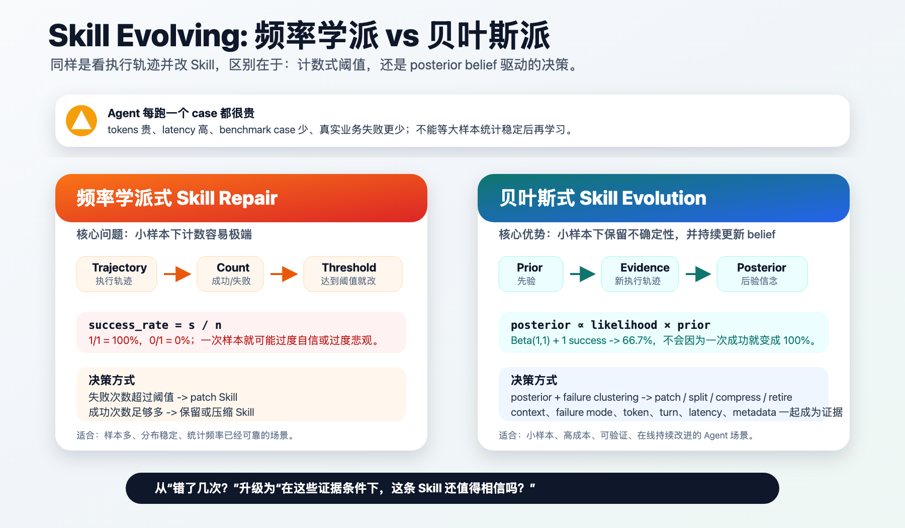

# 为什么 Bayesian-Agent 要用贝叶斯建模 Skill 进化

> 其实目前方法的本质也还是根据执行轨迹，看错哪里了去针对性地改 Skill。那么，我们采用贝叶斯方式建模这个过程的优势在哪里？贝叶斯对比频率学派的核心优势，在 Bayesian-Agent 框架下体现出来了吗？

这是一个很重要的问题。因为如果一个方法最后只是“错了就 patch”，那它不需要叫 Bayesian。它最多是 failure-driven prompt repair。

Bayesian-Agent 的核心主张不是“贝叶斯让 Skill 自动神奇变好”，而是：

**Agent 每跑一个 case 都很贵：tokens 贵、latency 高、benchmark case 少、真实业务失败更少。在样本少、每个样本很贵、不能等到大样本统计稳定时，贝叶斯可以把先验、不确定性和新证据统一起来，做更稳健的决策。**

也就是说，贝叶斯在这里解决的不是“如何写一句更强的 prompt”，而是“在稀疏、昂贵、连续到来的 verified trajectories 里，如何决定一条 Skill 是否可信、是否该改、怎么改、何时压缩或废弃”。



## 一、先承认：表层动作确实是看轨迹改 Skill

Bayesian-Agent 的外在行为可以被简单描述成：

```text
Run task -> Verify result -> Inspect failure -> Update Skill/SOP -> Run next task
```

这和很多 self-improving agent、prompt repair、SOP refinement 方法看起来很像。

例如在 SOP-Bench 中，如果 agent 算出了正确决策，但没有把目标 CSV 行的 `expected_output` 写成非空值，那么系统会把它归类为：

```text
failure_mode = left_expected_output_blank
```

如果这种失败重复出现，就会生成类似这样的 patch：

```text
After writing, re-read test_set_with_outputs.csv and confirm the target row's expected_output is non-empty.
If the target cell is empty, write the computed raw category string before finishing.
```

所以，表层上看，它确实是在“看错哪里，然后针对性改 Skill”。

区别在于：普通 repair 只留下了一个 patch，而 Bayesian-Agent 还留下了一份可持续更新的 belief state。

## 二、频率学派式 repair 的问题：小样本下太容易极端

最朴素的频率估计是：

```text
success_rate = success_count / total_count
```

如果一条 Skill 第一次运行成功：

```text
success_rate = 1 / 1 = 100%
```

如果第一次运行失败：

```text
success_rate = 0 / 1 = 0%
```

这在大样本、稳定分布下没有问题。但 Agent Skill 进化往往不是这种环境。

现实里更常见的是：

- 一个 benchmark 只有几十个 case。
- 真实业务中的失败案例更少，而且很珍贵。
- 每次 agent 执行都要花 token、工具时间和等待成本。
- 同一个 failure mode 可能只出现一两次，但已经足够提示一个可复用教训。
- LLM agent 有随机性，一次成功不代表 Skill 稳定，一次失败也不代表 Skill 完全无效。

在这种场景下，如果只用频率计数，很容易出现两种错误：

| 小样本观测 | 频率式结论 | 问题 |
|---|---|---|
| 1 次成功 | 成功率 100% | 过度自信，可能过早压缩或固化 Skill。 |
| 1 次失败 | 成功率 0% | 过度悲观，可能过早废弃或过拟合 patch。 |
| 1 次罕见失败 | 立即 patch | 容易把偶然噪声写进 Skill。 |
| 2 次同类失败 | 只是计数 +2 | 没有表达“失败正在聚类”的不确定性变化。 |

频率学派当然也可以加平滑、阈值和置信区间。但一旦我们开始说“不要因为一次失败就过度反应”“要保留先验”“要表达不确定性”“要根据 evidence 更新 belief”，我们其实已经在靠近贝叶斯思想。

## 三、贝叶斯带来的第一个优势：先验让小样本不极端

在 Bayesian-Agent 中，最简单的可选 backend 是 Beta-Bernoulli posterior。

设一条 Skill `h` 的真实成功概率是 `p_h`：

```text
p_h ~ Beta(alpha_0, beta_0)
```

当观察到 `s_h` 次成功和 `f_h` 次失败后：

```text
p_h | D_h ~ Beta(alpha_0 + s_h, beta_0 + f_h)
```

后验均值是：

```text
E[p_h | D_h]
= (alpha_0 + s_h) / (alpha_0 + beta_0 + s_h + f_h)
```

如果用一个均匀先验：

```text
alpha_0 = 1
beta_0 = 1
```

那么一次成功后：

```text
E[p_h | D_h] = (1 + 1) / (1 + 1 + 1) = 2/3 = 66.7%
```

一次失败后：

```text
E[p_h | D_h] = 1 / 3 = 33.3%
```

这和频率估计的 `100%` 或 `0%` 很不一样。

贝叶斯不是不相信新证据，而是不让单个样本把 belief 推到极端。这正适合 agent skill evolution，因为一次 trajectory 往往既昂贵，又带噪声。

## 四、贝叶斯带来的第二个优势：不只看成功率，还看“在什么条件下成功”

只用 Beta-Bernoulli 还不够。因为 Skill 的可靠性通常不是一个全局数值。

一条 Skill 可能在 SOP-Bench 里很好，但在 Lifelong AgentBench 里不行。也可能在低 token 任务上很好，但在高 token、长 turn、慢工具路径里变得不可靠。

所以 Bayesian-Agent v0.5 默认使用的是 feature-conditioned categorical Bayesian Evidence Model。

对一条 Skill hypothesis `h_k`，每条执行轨迹会形成一条 evidence：

```text
D_k = {(x_i, y_i)}
```

其中：

```text
y_i in {success, failure}
x_i = trajectory evidence features
```

当前实现里的 `x_i` 包括：

| Evidence feature | 含义 |
|---|---|
| `context` | 任务族、benchmark 或 harness 场景。 |
| `failure_mode` | 可复用的错误模式，比如 `left_expected_output_blank`。 |
| `token_bucket` | 本次执行落在哪个 token 成本区间。 |
| `turn_bucket` | 本次执行用了多少交互轮次。 |
| `latency_bucket` | 本次执行耗时落在哪个延迟区间。 |
| `metadata.*` | harness 或 benchmark 提供的短标量诊断信息。 |

模型估计：

```text
P(y | h_k, x) ∝ P(y | h_k) * product_j P(x_j | y, h_k)
```

这里的 `product_j` 表示对所有 evidence features 连乘。

这个公式的含义是：

```text
在 Skill h_k 下，
如果我观察到某个 context、failure mode、token bucket、turn bucket、latency bucket 和 metadata，
那么这条轨迹更像 success 还是 failure？
```

这比频率计数多了一层关键能力：它不只是问“这条 Skill 总体成功率是多少”，而是问“这条 Skill 在当前证据条件下是否可靠”。

## 五、贝叶斯带来的第三个优势：把 patch 决策变成 posterior-driven policy

如果没有 belief state，rewrite policy 往往只能写成硬规则：

```text
失败一次就改
失败两次就改
成功三次就压缩
失败四次就废弃
```

这些规则有用，但缺少解释力。

Bayesian-Agent 仍然保留了保守阈值，因为 v0.5 的目标是可审计、可实现，而不是把所有东西都包装成复杂推理。但这些阈值不是孤立存在的，它们围绕 posterior belief 工作。

当前默认 policy 的思想是：

| Policy | 当前含义 |
|---|---|
| `explore` | 没有足够 verified evidence，或者 posterior 仍不确定。 |
| `patch` | 同一 failure mode 至少出现 2 次，说明失败开始聚类。 |
| `compress` | 观测足够多，且 posterior success 较稳定，可以压缩 Skill 降低 token。 |
| `split` | 同一 Skill 跨多个 context，可能需要拆分成更细 SOP。 |
| `retire` | 失败证据足够多，posterior 显示该 Skill 明显不可靠。 |

这样一来，Skill evolution 从：

```text
错了 -> 改
```

变成：

```text
观察 trajectory -> 更新 belief -> 判断 uncertainty 和 failure clustering -> 决定 rewrite action
```

这就是 Bayesian-Agent 和普通 prompt repair 的本质差异。

## 六、什么时候我们的方法更适用

Bayesian-Agent 最适合的不是无限大数据、离线稳定分布，而是 agent 工程里更常见的小样本、高成本、在线更新场景。

| 场景 | 为什么适合 Bayesian-Agent |
|---|---|
| 小样本 benchmark | case 少，不能等频率统计稳定。 |
| 真实业务失败稀缺 | 每个失败都珍贵，需要最大化 evidence 利用率。 |
| 每次执行成本高 | token、latency、API、工具调用都贵，不能大量试错。 |
| failure mode 可复用 | 同类错误可以转化成后续 Skill/SOP patch。 |
| 需要增量修复已有 Agent | 可以读取 GA、Claude Code 或其他 harness 的失败轨迹，只修失败部分。 |
| 需要跨 harness 迁移 | posterior 绑定 normalized trajectory evidence，而不是某个框架内部状态。 |
| 同时关心准确率和效率 | token bucket、turn bucket、latency bucket 都进入 evidence model。 |
| 任务分布会持续变化 | posterior 可以随新轨迹在线更新，而不是固定一版 prompt。 |

所以更准确的定位是：

```text
Bayesian-Agent is especially useful for sample-scarce, cost-sensitive, online Skill/SOP evolution.
```

中文可以说：

```text
Bayesian-Agent 特别适合小样本、高成本、可验证、可持续积累经验的 Agent Skill/SOP 进化场景。
```

## 七、什么时候它不一定更好

贝叶斯不是魔法，也不是所有 Agent 场景都需要 Bayesian-Agent。

| 场景 | 为什么优势有限 |
|---|---|
| 样本极多且分布稳定 | 频率估计已经足够可靠。 |
| 没有 verifier | 没有可靠 success/failure evidence，posterior 没有根基。 |
| failure 完全随机 | 如果失败模式不可复用，改 Skill 意义有限。 |
| 问题需要参数训练 | 应该考虑 fine-tuning、RL 或继续预训练，而不是只改推理环境。 |
| 一次性任务 | 如果不会遇到相似 case，Skill evolution 的长期收益有限。 |

这也解释了 Bayesian-Agent 的边界：它不是替代预训练、微调或 RL 的参数训练方法，而是补足 inference-time learning 的工程层。

## 八、这套框架里“贝叶斯”已经体现在哪里

当前实现中，贝叶斯不是一个口号，而是落在几个具体对象上：

| 组件 | 贝叶斯体现 |
|---|---|
| `TrajectoryEvidence` | 把每次 verified run 规范成可更新证据。 |
| `BayesianSkillRegistry` | 为每条 Skill/SOP 维护 posterior belief state。 |
| `BetaBernoulliState` | 可选的全局 success/failure posterior。 |
| `CategoricalBayesState` | 默认 feature-conditioned evidence likelihood。 |
| `RewritePolicy` | 根据 posterior、failure clustering 和 evidence coverage 决定 rewrite action。 |
| `skill_evolution` artifacts | 保存每个 task 前后的 Skill context、posterior audit 和 belief snapshot。 |

不过也要诚实说明：v0.5 还不是完整的 Bayesian reasoning system。

已经实现的是：

```text
verified trajectory -> Bayesian evidence update -> posterior-driven Skill/SOP evolution
```

还在 roadmap 中的是：

```text
多 Skill hypothesis model selection
Thompson sampling 式 Skill selection
Bayesian decision theory 下的 cost-aware rewrite
层级贝叶斯建模不同 benchmark / harness / task family
贝叶斯网络建模 failure causality
```

这也是我们应该对外准确表述的地方：当前版本已经把“经验修补”推进到了“证据驱动的 posterior belief update”，但不会把它夸大成完整贝叶斯智能体。

## 九、最终总结

普通 self-evolving agent 的逻辑是：

```text
错了就改。
```

Bayesian-Agent 想做的是：

```text
知道为什么错，
知道在什么条件下错，
知道证据够不够支持改，
知道改完以后 belief 有没有真的变好。
```

频率式 repair 关注的是“出现了几次”。Bayesian-Agent 关注的是：

```text
在当前证据条件下，这条 Skill 还值得相信吗？
```

这就是贝叶斯在 Bayesian-Agent 框架里的核心价值。
